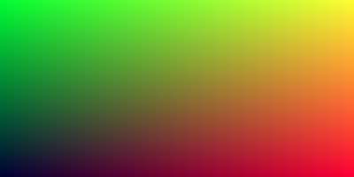
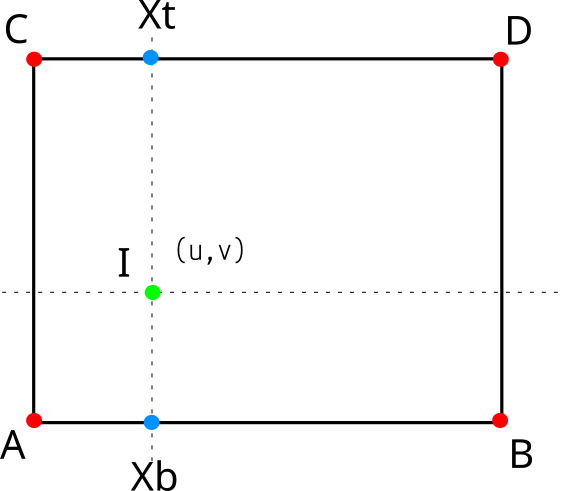

# DIM0451 - Computer Graphics 1

## Assignment #01 - PPM image and the `Background` class

## Introduction

This assignment is intended to make you have the first experience in creating a colored image and, at the same time, get ready to create a useful class for your Ray Tracing project: the `Background` class.
This class is responsible for returning a RGB color (radiance) every time a rays is shot into a Three-dimensional (3D) scene and hits nothing.

Usually the scene file will have a set of four colors assigned to each of the four corners of the _"background"_ and you have to linearly **interpolate** those colors to get a RGB color, say, at the `(x,y)` location inside the background image.

But before designing the `Background` class, we are going to _play_ with some code and learn how to create an image (more precisely, a PPM image), and how to interpolate values on a linear scale.

## Part 1: Simple image generation

In this part of the assignment you will need to create a program that sends to the _standard output_ information describing a [**PPM image**](https://en.wikipedia.org/wiki/Netpbm) in ASCII format. The target image should have 400 x 200 (width x height) of resolution, and each RGB pixel will have values from 0 to 255.

As we move from left to right on the output image (regardless of the row) the **red** channel should increase from zero to fully on (255).
Similarly, as we move from bottom to top on the image, the **green** channel should go from zero (at the bottom) to fully on 255 (at the top).
The **blue** channel, however, should remain constant at `20%` intensity throughout the image.

### The PPM Image's coordinate system

The PPM image's Coordinate System has its origin located at the top left corner.
The positive `X` goes from left to right, and the positive `Y` goes from top to bottom.
Note that the vertical axis is inverted in relation to the traditional sense of "top" and "bottom" of an image.

```
         O |   (top)    X
          -+------------+-->
           |            |
 (left)    |   Image    |    (right)
           |            |
          -+------------+
           | (bottom)
         Y v
```

Therefore, the image's lower left corner will be almost black (no green, no red, and 20% blue),
whereas the opposite corner (upper right corner) should be
full green + full red + 20% blue.
The expected result is the image below.

 <!--  -->



### The PPM image format

The basic PPM image format has the following **header**:

1. One line with the so called _magic number_, which is an indication of the type of image. For PPM images in ASCII mode this magic number is `P3`.
2. One line with two integer values, indicating the **width** (`W`) and **height** (`H`) of the image in pixels.
3. One line with the maximum value for a color, `MAX`. This is usually `255`.
4. Then we have `W` $`\times`$ `H` lines, each with three integer values (R, G, and B), varying from 0 to `MAX`. These lines are the _"body"_ of the image.

Of course, you do not need to place each of these information on a separate line, if you do not wish so. The only requirement is that these values should be separated with at least on white space. So technically, you could have all the image in a single line!

However, it's recommended that your program generate one information per line to make the file more _human readable_ and, therefore, easy to debug. In the particular case of the pixels, you may print one pixel color (a RGB triplet) per line. See the PPM file example below, copied from the [wikipedia](https://en.wikipedia.org/wiki/Netpbm).

```
P3           # "P3" means this is a RGB color image in ASCII
3 2          # "3 2" is the width and height of the image in pixels
255          # "255" is the maximum value for each color
# The part above is the header
# The part below is the image data: RGB triplets
255   0   0  # red
  0 255   0  # green
  0   0 255  # blue
255 255   0  # yellow
255 255 255  # white
  0   0   0  # black
```

## Part 2: Linear interpolation

In the previous part, you had to generate a image based on a **fixed** interpolation strategy, with predefined values for each of the color channels.
In this segment, we need to _generalize_ this task by allowing the client (i.e. the scene file) to specify a different color for each of the four corners of the image. Then, we calculate the internal color of the image by performing a **linear interpolation** in each of the image dimensions.

A parametric line between two points `A` and `B` represents a _weighted average_ between those two points.

$`P(t) = (1-t)A + tB`$

In this case $`P(t)`$ is a function that takes a real value $`t`$ and returns a location along the infinite line that connects $`A`$ to $`B`$. However, if we restrict the parameter to be $`t \in [0,1]`$, this function will only output values between those two points.

Note, for instance, that when $`t = 0`$ we have 100% of _"influence"_ of the value $`A`$ and 0% of _"influence"_ of the value $`B`$. Similarly, when $`t = 1`$, we have 0% of $`A`$ and 100% of $`B`$. This is a linear interpolation between those two values!

To apply this concept to colors you need to interpolate each RGB channel separately. However, this will only work for one dimension. To generate an interpolated color inside the **image plane** (which is 2D) we need to interpolate twice, which is called [**bilinear interpolation**](https://en.wikipedia.org/wiki/Bilinear_interpolation).

Suppose we need to find a interpolated color for a coordinate $`(u,v)`$ with $`u,v \in [0,1]`$.
Now assume that $`A`$ and $`B`$ are the colors assigned to the bottom left, and bottom right corners of the image, respectively.
Likewise, assume that $`C`$ and $`D`$ are assigned to the top left, and top right corners of the background image, respectively.
The bilinear interpolation works as follows:

1. We first interpolate between $`A`$ and $`B`$, with input parameter $`u`$, to get a temporary color $`Xb`$ (bottom).
2. Similarly, we interpolate between $`C`$ and $`D`$, with the same input paramter $`u`$, which yields a temporary color $`Xt`$ (top).
3. Finally, we interpolate between $`Xb`$ and $`Xt`$, with input paramter $`v`$, to get the final color $`I`$.

 <!--  -->



## Part 3: the `Background` class

Adapt the program developed in the Part 1 of this assignment so that

1. You now instantiate a `Background` object `bkg`, assigning four RGB colors to each of its corners, and;
2. Generate a new PPM image by _sampling_ each pixel of the image via methods of the `bkg` object.

Recall that the main purpose of the `Background` class is to _hide_ the bilinear interpolation described previously.
Here is a suggestion for the `Background` class interface.

```c++
class BackgroundColor {
  private:
    /// Each corner has a color associated with.
    RGBColor corners[4]={{0,0,0},{0,0,0},{0,0,0},{0,0,0}};
    /// Corner indices.
    enum Corners_e {
      bl=0, //!< Bottom left corner.
      tl,   //!< Top left corner.
      tr,   //!< Top right corner.
      br    //!< Bottom right corner.
    };

    /// Return the linearly interpolated color in [A;B], based on the parameter \f$0\leq t \leq 1.\f$
    RGBColor lerp( const RGBColor &A, const RGBColor &B, float t ) const;

  public:
    /// Ctro receives a list of four colors, for each corner.
    BackgroundColor( const std::vector< RGBColor >& colors );
    /// Dtro
    ~BackgroundColor() { };
    /// Sample and returns a color, based on the raster coordinate.
    RGBColor sampleUV( real_type u, real_type v ) const;
};
```
