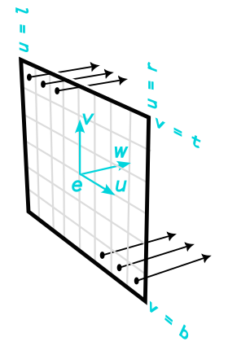

**COMPUTER GRAPHICS I (DIM0451) -- Ray Tracer Project**

# Project 02 - Rays and Cameras

### Table of Contents

1. [Introduction](#1-introduction)
2. [Raster Image](#2-raster-image)
3. [The Problem](#3-the-problem)
   1. [Pixels to Screen Space](#31-mapping-pixels-to-screen-space)
   2. [The Camera Frame](#32-determining-the-camera-frame)
   3. [Shooting Rays](#33-generating-the-rays)
4. [Requirements](#4-requirements)
5. [Scene Format](#5-the-scene-format)
6. [Extra Feature](#6-extra-feature)
7. [Recommendations](#7-recommendations)

## 1. Introduction

In this programming project you will expand your ray tracing project, adding rays and a camera.

At the core of a ray tracer (RT), as the name implies, is the entity **ray**. A ray encodes information of a line segment, which usually originates at the _eye_ (or _origin_) of a camera with direction determined by the grid of pixels at the image plane. In other words, the RT shoots rays through pixels of an image into a scene. Therefore, the role of the **camera** in a RT is to generate the rays that must interact with the scene.

The camera model we need to incorporate to the RT follows the [_pinhole camera model_](https://en.wikipedia.org/wiki/Pinhole_camera_model), with the difference that the _image plane_ is placed in front of the _eye_ of the camera, rather than behind it. This change does not alter the final result and makes the implementation easier.

If we want to expand the possibilities of images that our RT might create, it is important to offer different types of **cameras**. The cameras we need to implement are **perspective** and **orthographic**. Both cameras are _projective_ cameras, with the perspective camera shooting rays from a _single point_ to every pixel area into the scene, whereas the orthographic shoots rays from _each pixel_ to a direction (usually) perpendicular to the image plane into the scene.

The Figure 1 shows the two types of projective cameras describes so far (original source: [Shirley 2009](#shirley2009)).

 <!--  -->




Another important decision we have to make is regarding the camera [**handedness**](https://en.wikipedia.org/wiki/Cartesian_coordinate_system#Orientation_and_handedness). We are following the _left-hand rule_ to determine the camera's frame. Note, however, that the frame of the cameras shown in Figure 1 follows the _right-hand rule_. Because we have adopted the _left-hand rule_ instead, the $\mathbf{\hat{w}}$ should be pointed in the other direction, towards the image plane.

Usually the camera is positioned at the origin looking down at the $Z^+$ axis. Later on we will introduce the tools to move the camera around. The same mechanism, called _geometric transformations_, shall be used to place and/or modify other components of the scene in an upcoming project.

## 2. Raster Image

Before we continue our journey to find the right math machinery to produce rays, it is important to understand the concept of **raster image**. Recall from our previous classes that the _rendering equation_ is a mathematical model that, if solved for a given point on a virtual image $(x,y) \in \mathbb{R^2}$, it yields a color value for that point. However, we need to sample this continuous (solution) domain so that we may produce pixel-based images, which is called a _raster image_. This means that a pixel value produced by the (estimation of) the rendering equation is a local average of the color of the virtual image, and it's called a _point sample_ of an image. So, a value $v$ of a pixel is the value of the virtual image in the vicinity of this pixel or grid point.

From here on, a raster image is indexed by a pair $(i,j)$ indicating column $(i)$ and row $(j)$ of the pixel, counting from the bottom left corner of the raster image. If an image has $n_x$ columns by $n_y$ rows of pixel, the bottom left is $(0,0)$ and the top right is $(n_x-1,n_y-1)$.

Now we need a 2D real screen coordinates to specify pixel positions. The pixels will be located at integer coordinates, as show in the image below. So the **rectangular continuous domain** for this continuous image with $n_x$ width and $n_y$ height is $R=[-0.5, n_x-0.5]\times[-0.5, n_y-0.5]$ and the pixels integer coordinates place them at the center of the pixel area.

 
 <!--  -->

## 3. The Problem

At the heart of this project we are trying to solve the following problem:

> _How to generate a ray for each pixel of the image, according to the type of the camera specified in the scene file?_

To solve this problem, we are given (**input**) the following information:

1. The pixel coordinate $(i,j)$, we want to generate the ray for.
2. The _screen space_ dimensions `"l r b t"` (left, right, bottom, top), read from the input scene file, OR the vertical field of view angle, _fovy_, and the _aspect ratio_ = (image width/image height), that works only for perspective cameras.
3. A point in _world space_ where the camera is located at.
4. A point in _world space_ where the camera is pointed at.
5. A vector in _world space_ that indicates the _up_ direction of the camera.

The **output** of the camera algorithm should be the `ray` object.

If you examine carefully the images in Figure 1 above, you will identify that each ray, regardless of the camera type, has an _origin_ and a _direction_. So, our mission is to develop the math machinery that enable us to determine these two elements that define a ray.

Our first objective is to identify a _correspondence_ between the **image space** (the pixels, e.g. $1920 \times 1080$) and the **screen space** (which is called "image plane" in the Figure 1). Usually, the _screen space_ is a 2D _normalized_ frame of reference. The dimensions of the _screen space_ comes from the input scene file explicitly or are deduced based on the `Film` dimensions. Note that for both the orthographic and perspective cameras, the bounds of the screen space come from the scene file as the attribute `screen_window`, which is a list of 4 values, as in `screen_window="-1.777 1.777 -1.0 1.0"`^[This represents a $16:9$ proportion found in a full HD resolution]. By default, the values for this attribute is $[-1,1]$ along the shorter image axis and is set proportionally along the other (longer) axis.

For the _perspective_ camera case, it might be preferable to specify the `screen_window` values (i.e. `l r b t`) _indirectly_; this can be done by defining a `fovy` angle (field of view in Y). This angle enables us to determine the _height_ of the _screen window_ (the near plane) and from this value it is possible to find the desired _width_ by keeping the same _aspect ratio_ defined by the film dimensions. The image below tries to show the relationship between the vertical angle `fovy` and the screen's height, assuming a _focal distance_ equal to 1.

 
 <!-- -->

So, the _correspondence_ we need is just a couple of _equations_ that takes a $(i,j)$ pixel coordinate in the _image space_ and finds out a corresponding $(u,v)$ location on the _screen space_. The next section describes the steps to find out these equations.

### 3.1 Mapping Pixels to Screen Space

For both types of the camera we need to solve this basic sub-problem:

> _"How does a pixel $(i,j)$ on the *image space* maps to a coordinate $(u,v)$ on the *screen space*?"_

Recall that the camera needs this information to generate the rays, depending of the type of the camera. For the orthographic camera, the $(u,v)$ defines the ray's origin; whereas for the perspective camera the $(u,v)$ and the origin $\mathbf{e}$ define the direction of the ray.

In both cases first we need to map the _image space_ to the _screen space_, $[-0.5; n_x-0.5] \times [-0.5; n_y-0.5] \mapsto [l; r] \times [b; t]$, where $n_x$ and $n_y$ are, respectively, the horizontal and vertical number of pixel of the image we want to create. This is a linear mapping done in each direction. Let us determine the equation only for the $X$ dimension. For a given $i$ value on the _image space_ we want to find the corresponding $u$ value on the _screen space_, so we have the following relation

$\frac{i-(-0.5)}{u-l}=\frac{n_x}{r-l},$

and the unknown is $u$. Rearranging we got $(i+0.5)(r-l) =n_x(u-l)$, then $(u-l)=(r-l)(i+0.5)/n_x$, and finally $u = l + (r-l)(i+0.5)/n_x, \, i\in[-0.5;n_x-0.5]$. For both dimensions we have:

$\left\{\begin{array}{lcl} u & = &l + (r-l)(i+0.5)/n_x\\ v & = & b + (t-b)(j+0.5)/n_y\end{array}\right.$

<!-- For both the orthographic and perspective cameras, the bounds of the film plane should be provided in the scene file under the attribute `screen_window` as a list of 4 values, as in `"l r b t"`. By default, the values for this attribute is $[-1,1]$ along the shorter image axis and is set proportionally along the other (longer) axis. -->

So far, we are able to identify the corresponding $(u,v)$ point on the _screen space_ given the first two input information we were provided with. To complete our task and solve the original problem, we now need to determine the 3D _frame_ that defines the **_camera space_**. If we have this _frame_ we have all the ingredients we need to create a ray, which is our final objective. So, the next section shows how to define the camera _frame_.

### 3.2 Determining the Camera Frame

Basically, what we need to do is to determine the _camera orthonormal frame_ $[\mathbf{e}, (\mathbf{\hat{u}},\mathbf{\hat{v}},\mathbf{\hat{w}})]$.

Recall the list of input information we always receive from the scene file. Now we are going to use the last three pieces of information from the scene file to calculate the camera's frame: the (1) _look from_ point, the (2) _look at_ point, and the (3) _vup_ vector. The first point _look from_ is the $\mathbf{e}$. The first two points together define the camera's _gaze_ direction, while the last vector provides the camera orientation. If we normalize the _gaze_ vector we got the $\mathbf{\hat{w}}$ vector. From that, we find a vector pointing to the right, perpendicular to the plane defined by the $\mathbf{\hat{w}}$ and _vup_ plane, using cross product; this is the camera's $\mathbf{\hat{u}}$ vector (after normalized). Finally, based on the two previously found vector, $\mathbf{\hat{w}}$ and $\mathbf{\hat{u}}$, we apply the cross product again to get the last vector $\mathbf{\hat{v}}$.

In summary, the steps are:

1. `Vector3 gaze = look_at - look_from; Vector3 w = normalize(gaze); // left-hand orientation`
2. `Vector3 u = normalize( cross( vup, w ) ); // The order inside cross matters. Can you guess why?`
3. `Vector3 v = normalize( cross ( w, u ) );`
4. `Point e = look_from;`

Finally, we now have all pieces of the puzzle. In the next section we describe how to generate the rays.

### 3.3 Generating the Rays

Assuming that the camera _frame_ is $[\mathbf{e}, (\mathbf{\hat{u}},\mathbf{\hat{v}}, \mathbf{\hat{w}})]$, as depicted in the Figure 1 above, we can define a camera ray as follows:

1. For the **orthographic** camera, we have

   `ray.direction` $\gets \mathbf{\hat{w}}$

   `ray.origin` $\gets \mathbf{e}+u\mathbf{\hat{u}} + v\mathbf{\hat{v}}$

2. For the **perspective** camera, we have

   `ray.direction` $\gets (fd)\mathbf{\hat{w}}+u\mathbf{\hat{u}} + v\mathbf{\hat{v}}$

   `ray.origin` $\gets \mathbf{e}$

where $(fd)$ is the _focal distance_ that we may assume to be 1, and $(u,v)$ are the coordinate we found in Section 1.2.

## 4. Requirements

You should implement the following classes and integrate then into your RT.

1. A class `Ray` the represents a single ray. Internal members are the origin ray (a point in 3D) and the ray direction (a vector in 3D). You may want to provide methods to _normalize_ the ray, and a method that returns the value of a point given a parameter `t` to the ray, as in

```c++
class Ray {
    public:
        Ray (const Point3& o, const Vector3& d,
            real_type start=0, real_type end=INFINITY) : o{o}, d{d},
            t_min{start}, t_max{end} {/*empty*/}
        Ray() : t_min{0.f}, t_max{INFINITY}{/*empty*/}
    private:
        Point3 o; //!< origin
        Vector3 d: //!< direction
        mutable real_type t_min, t_max //!< parameters
        // ... the methods goes here
        Point3 operator()(real_type t) const { return o + d * t; }
};

Ray r{ Point3{0,0,0}, Vector3{3,2,-4} }; // creating an infinity ray.
float t{2.3};                            // a parameter for the ray.
Point3 p = r( t );                       // overloading operator()(), so that it returns o + t*d.
```

3. A class `Camera` that is responsible for implementing the camera model described in class. The suggestion here is to create a virtual class first, with the method `generate_ray()` and derive the other camera classes from it. This method receives a pixel (or sub pixel) coordinate and returns a ray passing through that point.

```c++
class Camera{
        Ray generate_ray(int x, int y) = 0;
};
class PerspectiveCamera : public Camera {
	// ...
};
class OrthographicCamera : public Camera {
	// ...
};
```

## 5. The Scene Format

Here we provide a basic XML format with the camera tag included.

Here is an example scene file with a **orthographic** camera:

```xml
<RT3>
    <lookat look_from="0 7 0" look_at="0 0 0" up="0 0 1" />
    <camera type="orthographic" screen_window="-5.3 5.3 -4 4"/>
    <film type="image" x_res="2800" y_res="1800" crop_window="0 1 0 1"
        filename="../images/gcodex_matte_ortho.png"
        img_type="png"  gamma_corrected="yes" />

    <world_begin/>
        <background type="colors" color="0.14 0.19 0.26" />
        <!-- Here goes the rest of the file, including scene definition. -->
    <world_end/>
</RT3>
```

The attributes `look_from`, `look_at`, and `up` define the two vectors necessary to build the camera's frame: _gaze_ (`look_at` - `look_from`), and _vup_. The goal here is to define the camera's orthonormal basis $\mathbf{\hat{u}}$, $\mathbf{\hat{v}}$, and $\mathbf{\hat{w}}$.

The attribute `screen_window` of the `camera` tag defines the _view plane_ dimensions by specifying its horizontal and vertical limits, respectively `l` (left), `r` (right), `b` (bottom), and `t` (top). These dimensions define a box that should encapsulate the entire scene we want to view. There is no need to define the limits for the $Z$ axis, because there is no limits to the ray's reach into that dimension. These values, at this stage, should correspond to values in world coordinates. This means that a sphere _S1_ with `radius=2` and `center=(0,1,3)` would be visible, whereas a sphere _S2_ with the same radius but located at `center = point3(-10,1,3)` would not be visible. Another interesting fact is that a sphere _S3_ with the same radius but located at `center = point3(-2, 2, 300)` would appear to have the same projected circle shape that of sphere _S1_ on the final image: can you explain why?

Notice that the aspect ratio of the `screen_window` dimensions must be the same of the image dimension, if we want an image with undistorted objects (i.e. the sphere projection is a perfect circle). You may experiment with different aspect ratios in the next project and see the effect of this on the generated image.

All elements are declared inside a `RT3` tag. _You might want to replace this tag with you ray tracer program name._ At this stage, we only have the tags `background` to compose the scene. Later on we will add `scene`, `light`, `material`, etc.

Here is an example scene file with a **perspective** camera:

```xml
<RT3>
    <lookat look_from="0 4 -11" look_at="0 1 0" up="0 1 0" />
    <camera type="perspective" fovy="30" />
    <!-- The screen_window will default to  "-1.555 1.555 -1 1" /> -->
    <film type="image" x_res="2800" y_res="1800" crop_window="0 1 0 1"
        filename="../images/gcodex_matte_ortho.png"
        img_type="png"  gamma_corrected="yes" />

    <world_begin/>
        <background type="colors" color="0.14 0.19 0.26" />
        <!-- Here goes the rest of the file, including scene definition. -->
    <world_end/>
</RT3>
```

The attribute `fovy` corresponds to the vertical angle of the perspective [viewing frustum](https://en.wikipedia.org/wiki/Viewing_frustum) expressed in degrees. The smaller the angle the more zoom we get into the scene. The aspect of the image is often determined by the image dimensions, however it may be overridden if the `frame_aspect` if specified. The attribute `focal_distance` is the distance of the view plane along the $Z^+$ assuming the camera located at the origin with its _frame_ aligned with the world: this is called the _focal distance_. Because we are not yet implementing a lens for our camera, the focal distance value is irrelevant and, thus, it might be omitted. In that case it defaults to 1.

Next, we found a modified version of the main loop introduced in the previous project, illustrating a possible usage of the new classes.

```c++
\\ [1] Parser and load scene file
std::vector<Primitives> scene; // list of objects in the scene. Not yet implemented.
\\ [2] Instantiate the Camera and Background objects.
Camera camera{...};
\\ [3] Enter the ray tracing main loop
int main() {
    // Perform objects initialization here.
    // The Film object holds the memory for the image.
    // ...
    auto w = camera.film.width(); // Retrieve the image dimensions in pixels.
    auto h = camera.film.height();
    // Traverse all pixels to shoot rays from.
    for ( int j = h-1 ; j >= 0 ; j-- ) {
        for( int i = 0 ; i < w ; i++ ) {
            // Generate ray with the Shirley method.
            Ray r2 = camera.generate_ray( i, j );
            // Print out the two rays, that must be the same (regardless of the method).
            std::cout << "Ray1: " << r1 << ", Ray2: " << r2 << std::endl;
            std::cout << "Point at t=2, ray(2) = " << r1(2.f) << std::endl;
            // Rays are not hitting the scene just yet; so let us sample the background.
            auto color = background.sample( float(i)/float(w), float(j)/float(h), r1 ); // get background color.
            camera.film.add( Point2{i,j}, color ); // set image buffer at position (i,j), accordingly.
        }
    }
    // send image color buffer to the output file.
    camera.film.write_image();
}
```

## 6. Extra Feature

Create a Background class that supports spherical projection of textures. (I'll write more on this later on)

<!--
Make your RT support [**oblique projections**](https://en.wikipedia.org/wiki/Oblique_projection) (perspective or parallel) by allowing the specification of a `vpn`, _view plane normal_. Remember that an orthographic camera is a parallel camera in which the `vpn$=\mathbf{\hat{w}}$. Also, our perspective camera assumes that a vector perpendicular to the view plane passing through the center of the view plane is parallel to $=\mathbf{\hat{w}}$.

In other words, regardless of the chosen camera, the default value of the `vpn`, if not specified in the scene file, is to be
$\mathbf{\hat{w}}$. However, if the scene specifies the attribute `vpn="1 0 1"` inside the `camera` tag we would have that vector as the view plane normal. See examples below (source [wikipedia](https://en.wikipedia.org/wiki/Oblique_projection#/media/File:Various_projections_of_cube_above_plane.svg))

 
-->

## 7. Recommendations

Read the Chapter 4 of [Shirley 2009](#shirley2009). In particular, Section 3.2 (Chapter 3) talks about the pixel as an area; Section 4.2 (Chapter 4) introduces the types of projection, and Section 4.3 (Chapter 4) explains how to generate rays based on the chosen camera type.

### References

<A name="shirley2009"></A>

- P. Shirley and S. Marschner., "Fundamentals of Computer Graphics", 3rd ed., 2009, A K Peters.
