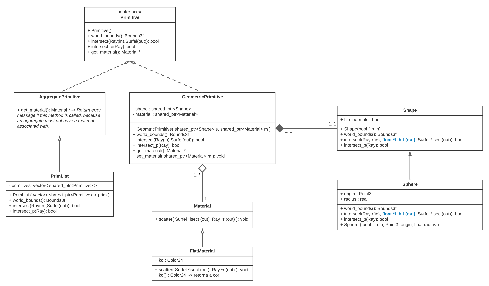
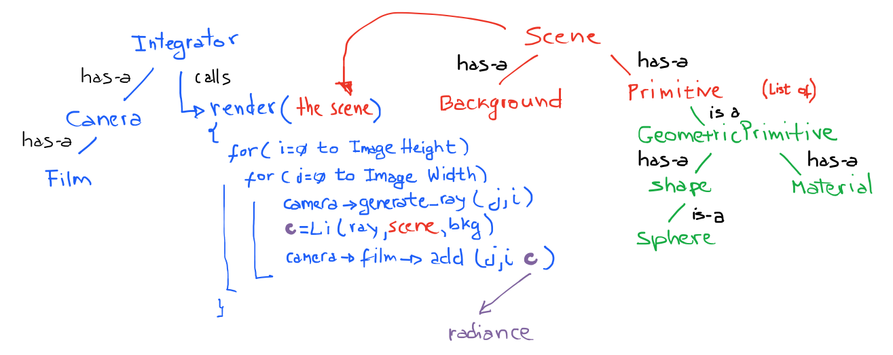
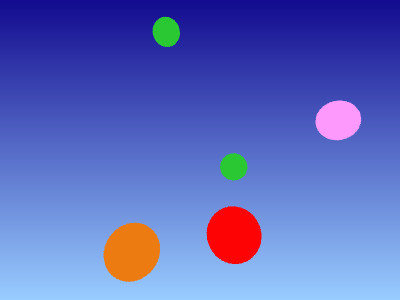
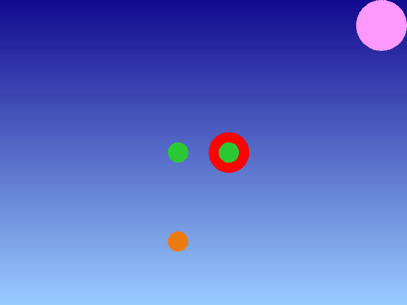
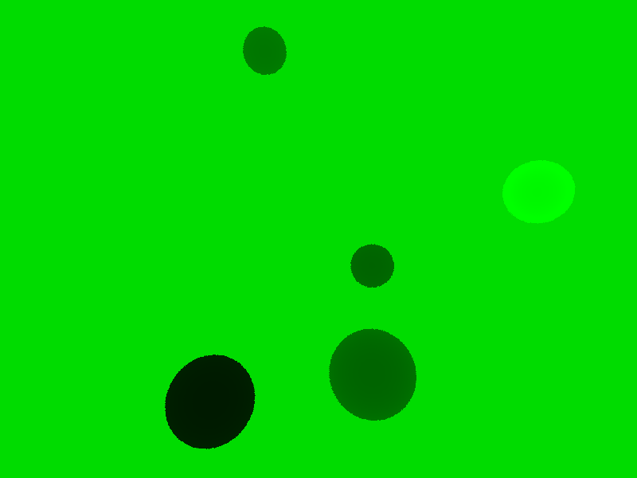
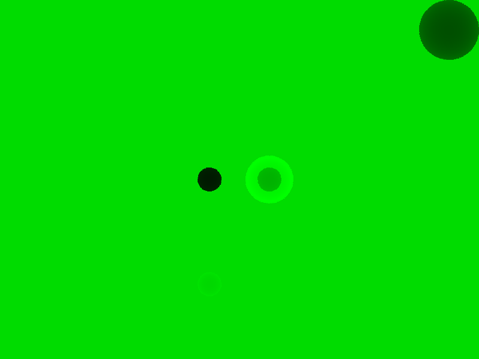
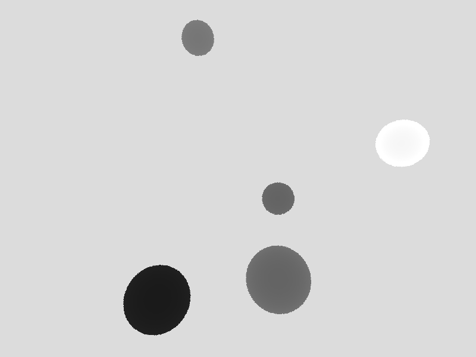
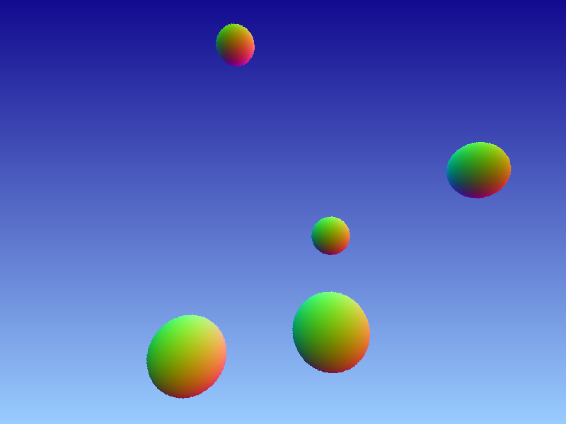
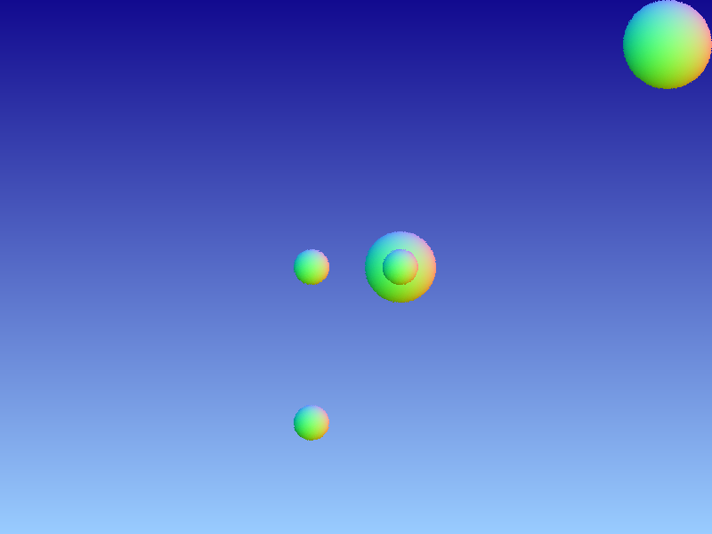

# Project 04 - Integrators & Materials

## 1. Introduction

In this programming project you will expand your ray tracing architecture to include the concept of **integrators** and **materials**.

Integrators are algorithms that determines the total incoming [_radiance_](https://en.wikipedia.org/wiki/Radiance) at each rays's origin. An integrator can be physically based, an approximation of a physical model, or simply an artistic expression.

Materials represent the behavior of light rays when they interact with a medium. They are responsible for the look and feel of elements of the scene, such as color, their diffuse of plastic appearance, etc.

These two new entities, along with _lights_ (introduced in an upcoming project), are essential for producing realistic images.

To accommodate these two new additions to our ray tracer and allow us to mix and match integrators and materials, we need to modify some aspects of our system architecture. This is the primary goal of this project, which will culminate with the implementation of three non-photorealistic _integrators_, namely, `FlatIntegrator`, `DepthMapIntegrator`, and `NormalMapIntegrator`. These integrators are described later in this document. Additionally, we will define a `FlatMaterial`, which will only be necessary if your scene is calling a `FlatIntegrator`.

## 2. System Architecture Overview

Here we introduce a _suggestion_ of how to organize you ray tracer. You **do not have to necessarily follow this architecture**, as long as your program may generate the images requested in this project.

## 2.1 The main function

This is _the entry point_ that controls the execution flow. It would be responsible for:

1. Parsing the scene file and instantiating the global objects.
2. Call the rendering function and write the result in an image.
3. Performing any necessary clean-up procedure (free the memory associated with the global objects).

## 2.2 A Description of the RT classes

The **API** is the main (static) class that manages all the information of the system that comes from a scene file. The **parser** step reads information from the scene file and feeds them to the `API` class through a series of methods. Most of the `API`'s methods are a direct mapping from the _tags_ we may find in the scene file. This approach has the advantage of decoupling the input interface from the main ray tracing engine; this strategy allows your system to support other scene file description formats by just implementing a suitable parser and calling the proper `API`'s methods. The rendering process begins only when the parser finds the tag `<world_end>` and calls the `API::world_end()` method.

Here is a list of all classes that compose the RT3 system architecture so far, and a brief description of their purpose. We are loosely following the architecture model proposed in [`pbr`](http://www.pbr-book.org/3ed-2018/contents.html).

### **Primitives**, **Shapes** and **Material**

In the RT3 architecture a **primitive** is not necessary a sphere, a triangle or a triangle mesh, but rather it is an _abstraction_ for a geometric form. The primitive has _virtual methods_ to calculate **ray intersection**, return the primitive's **bounding box**, and returning the **material** associated with the primitive. <!--This makes all the derived class to have to implement these methods. -->Having an abstract class like `Primitive` has the advantage of creating a _common interface_ that all derived classes throughout the RT3 system has to implement. This also supports a decoupling between the object information (geometric and material info) and the shading (integrator) part of the RT3 system. This feature will hopefully become clearer after we explain the other classes derived from `Primitive` and introduce the `Integrator` class.

The first concrete class derived from a `Primitive` is a `GeometricPrimitive`, which represents the shape and appearance of a concrete object in the scene (sphere, 3D plane, triangle mesh, etc.). This class has a pointer to an abstract class `Shape` (the _association_ relationship, from the Object Oriented Paradigm) and a pointer to an abstract `Material` (also an _association_ relationship). This approach encodes in a single class a two-level abstraction.

The `Shape` is the base class for low level object classes like triangle, sphere, box, etc., and provides access to the raw geometric properties of the object, such as the bounding box and a ray intersection routine (recall the sphere class in Project 03).

The `Material` describes how an object interacts with light. For the purpose of this project, we only have one concrete material class derived from this class, `FlatMaterial` which has only one information: a color. A material specification shall be read from the scene file to be stored in two possible ways: (1) as the **current** (anonymous) material, or (2) in a **library of named materials**. In the former case, all the objects the system parses after the declaration of an anonymous material, with the tag `<material ...>`, will automatically be bound to that _current material_, unless the object is explicitly bound (via attribute) to a _named material_ or another anonymous material declaration is found in the scene file, which becomes the _current material_. In the later case, your system will just store the material in the library, associating it to a unique string (name). To bound a _named material_ to an object it is necessary to add a tag `<named_material name="material_id">` to "activate" (i.e. make it the _current material_) the named material before the object definition, or to explicitly define the `material="material_id"` attribute within the object tag.

```xml
<RT3>
    <!-- The Scene -->
    <world_begin/>
        <!-- The Background -->
        <background type="colors" bl="153 204 255" tl="18 10 143" tr="18 10 143" br="153 204 255" />
        <!-- Creating a named material -->
        <make_named_material type="flat" name="green" color="42 201 51"  />

        <!-- Using a named material -->
        <named_material name="green"/>
        <object type="sphere" radius="0.4" center="-1 3.5 5"/>
        <object type="sphere" radius="0.4" center="1 -0.5 5" />

        <!-- Creating an anonymous material -->
        <material type="flat" color="236 124 17" /> <!-- Gold -->
        <object type="sphere" radius="0.4" center="-1 -1.5 1.5"/>

        <material type="flat" color="253 153 253" /> <!-- Pink -->
        <object type="sphere" radius="1" center="7 1.5 10" />

        <material type="flat" color="253 3 3" /> <!-- Red -->
        <object type="sphere" radius="0.8" center="1 -2.5 5" />
    <world_end/>
</RT3>
```

Other concrete class derived from a `Primitive` is an `Aggregate`, which provides an interface for **grouping multiple `Primitive` objects together**. Because `Aggregate` implements the `Primitive` interface, it provides the same interface we need to ask for an intersection, for example. This behavior allows the `Scene` object to only have a single (smart) pointer to a `Primitive`; this `Primitive` pointer may represent a single shape (`GeometricPrimitive`), a simple list of objects (`Aggregate`), or an acceleration structure (`Aggregate`), such as a _kd-tree_. This way, the `Integrator` can check for intersection without needing to know whether the object is a simple geometric shape, or a collection of several objects. In addition, to add new acceleration structures (a future project), we just need to create a new class derived from `Aggregate` (and, consequently, from `Primitive`).

<!-- The `Primitive` class is the base class for many other classes, such as `GeometricPrimitive` (a single primitive) or `Aggregate` (a collection of primitives).
The primitive has _virtual methods_ to calculate ray intersection, return the primitive's  bounding box, and returning the material associated with the primitive. This makes all the derived class to have to implement these methods. Another benefit is that a `Scene` only needs to keep a single (smart) pointer to a primitive, because a primitive may be (and usually is) a collection of (low level) primitives. -->

The image below contains a **class diagram** specified in [Unified Modeling Language](https://en.wikipedia.org/wiki/Unified_Modeling_Language "Unified Modeling Language") (UML) for the classes introduced in this section.



### The Scene and the Integrator

A **Scene** is a class the ultimately will have a `Primitive` (recall, this might be a single object, or a collection of primitives), a list of lights (not necessary in this project), and a **background** object. This is a _singleton_ object and is passed down to the **Integrator** object so that it may create the corresponding image of the scene.

All the information related to a scene is found in the scene file between the tags `<world_begin/>` and `<world_end/>`.

The **Integrator** encapsulates an algorithm that determines how to _integrate_ the [radiance](https://en.wikipedia.org/wiki/Radiance) along a ray so that a color (or spectral value) may be returned. All integrators have to provide two methods: `render(const Scene& scene)` , that controls the **rendering loop**, and; `Color24 Li(const Ray& ray, const Scene& scene)` that determines and returns a color. The `Li(..)` method is usually called inside the `render()` method. An integrator also keeps a pointer to a `Camera`. Recall from the previous project that the **Camera** (`OrthographicCamera` or `PerspectiveCamera`) is a class that generates rays from input pixels. A camera **has** a `Film` object that basically represents an image, has a file name associated with, assign colors to pixels, and write the image (buffer) to a file.

Here you have a visual summary of all these classes and their interdependence.



### Summary of the rendering steps in RT3

In summary, the sequence of steps the RT3 takes while parsing a scene file is:

1. Parse information related to the **integrator** we need to create. For that we need:
   - The _camera_ and _film_ information.
   - The type of integrator
2. Parse information related to the **scene** we want to visualize. For that we need: + All primitives and materials defined in the virtual world. + Background information.
   After all these information are gathered, the RT3 system calls the Integrator's `render()` method that contains the famous rendering loop typical of all ray tracers.

## 2.3 Suggested Implementation for the RT3 class

Here goes a suggestion for implementing the two main classes described earlier, `Scene` and `Integrator`.

### `Scene` class

This is the class that maintains the data structures that hold primitives, lights, and the background (for now).

```cpp
class Scene {
    //=== Public data
    public:
        //std::vector<shared_ptr<Light>> lights; // list of lights
        std::shared_ptr< Background > background; // The background object.
    private:
        std::shared_ptr<Primitive> aggregate; // The scene graph of objects, acceleration structure.

    //=== Public interface
    public:
        Scene( std::shared_ptr<Primitive> ag, std::unique_ptr< Background > bkg)
             : background{bkg}, aggregate{ag}
        {/* empty */}
        /// Determines the intersection info; return true if there is an intersection.
        bool intersect( const Ray& r, Surfel *isect ) const;
        /*! A faster version that only determines whether there is an intersection or not;
         * it doesn't calculate the intersection info.
         */
        bool intersect_p( const Ray& r ) const;
};
```

### `Integrator` and `SamplerIntegrator` classes

This class represents an entity that **has** a camera, and **receives** a scene to generate an image from.

```cpp
class Integrator {
	public:
		virtual ~Integrator();
		virtual void render( const Scene& scene ) =0;
};

class SamplerIntegrator : public Integrator {
	//=== Public interface
	public:
		virtual ~SamplerIntegrator();
		SamplerIntegrator( std::shared_ptr<const Camera> cam ) : camera{cam};

		virtual Color24 Li( const Ray& ray, const Scene& scene ) const = 0;
		virtual void render( const Scene& scene );
		virtual void preprocess( const Scene& scene )

	protected:
		std::shared_ptr<const Camera> camera;
};
```

The `render(...)` method runs the main application loop that invokes the `Li(...)` method for each possible ray. The `Li(...)` method, in turn, is a pure virtual method that returns the **incident radiance** at the origin of a given ray; each subclass of `SamplerIntegrator` must provide an implementation of this method. The `preprocess(...)` method is an optional method that might prepare a scene or any auxiliary data structure for future processing.

This is how all these classes might work together.

```cpp
int main(...) {
	API::init_engine(argv[1]);
	API::run();
	API::clean_up();
}

// Recall that API class keeps track several data structures to store all the information
// parsed from the scene file.
void API::run() {
	// [1] Parser and store in the API's internal structures the following:
	while( /* not finished scene file */ ) {
		// + Background info.
		// + Film info.
		// + Camera info.
		// + Primitives info.
		// + Material info.

		// [2] Found the <world_end> tag in the scene. It's time to run the rendering loop.
		if ( tag == "world_end" )
			API::world_end();
	}
}

void API::world_end()
{
    // [1] Create the integrator, whichever type has been requested: Flat, Depth, Normal
    the_integrator.reset( make_integrator() ); // make Film, make Camera.
    // [2] Create the scene.
    the_scene.reset( make_scene() ); // make Primitives, make Background.
    // [3] Run integrator if previous instantiation went ok
    if ( the_integrator and the_scene )
    {
          auto start = std::chrono::steady_clock::now();
          the_integrator->render( *the_scene ); // Main ray tracer loop!!!
          auto end = std::chrono::steady_clock::now();
    }
}

// Enter the ray tracing main loop; this is the default render() method.
// Notice that the FlatIntegrator does not need to override this method.
// It relies on the version provided by the base class (SamplerIntegrator).
void SamplerIntegrator::render(const Scene& scene) {
    // Always call the preprocess() before doing any rendering.
    // This might be just an empty method, or not, depending on the integrator's needs.
    preprocess();

    // This might just be a tile (part) of an image, rendered in parallel.
    Point2i img_dim = camera->film->dimensions();
    for ( int y = 0 ; y < img_dim.y ; y++ ) {
        for( int x = 0 ; x < img_dim.x ; x++ ) {
            // Determine the ray for the current camera type.
            point3 screen_coord{ float(x)/float(img_dim.x), float(y)/float(img_dim.y) };
            Ray ray = cam.generate_ray( screen_coord ); // Generate the ray from (x,y)
            // Determine the incoming light.
            auto temp_L =  Li( ray, scene );
            Color24 L = (temp_L.has_value()) ?  temp_L.value() : scene.background->sampleXYZ(screen_coord) ;
            // Add color (radiance) to the image.
            camera->film->add_sample( Point2i( x, y ), L ); // Set color of pixel (x,y) to L.
        }
    }
    // Send image color buffer to the output file.
    camera->film->write_img( image );
}

// This method must be overridden by all classes derived from SamplerIntegrator.
/// Determines a color for the incoming ray.
std::optional<Color24> FlatIntegrator::Li(const Ray& ray, const Scene& scene)
{
    Color24 L(0,0,0); // The radiance
    // Find closest ray intersection or return background radiance.
    Surfel isect; // Intersection information.
    if (!scene.intersect(ray, &isect)) {
        return {}; // empty object.
    }
    // Some form of determining the incoming radiance at the ray's origin.
    // Polymorphism in action.
    FlatMaterial *fm = dynamic_cast< FlatMaterial *>( iscet.primitive->get_material() );
    // Assign diffuse color to L.
    L = fm->kd(); // Call a method present only in FlatMaterial.
    return L;
}
```

## 3. The Flat Integrator

The first integrators we are going to create is the `FlatIntegrator`: each time a ray hits an object, regardless of the objects normal or the presence (or absence) of lights, the color is always the same for the entire object.

The scene file now must support tags to specify material and the integrator information. Remember when the parser finds a material description in a scene it saves that information in the _current material_ pointer. All object declarations that follow are automatically associated with the _current material_, unless a new material is specified and becomes the _current material_.

There is a new tag `integrator` that may contain one or more information related to the integrators. The scene file also presents two **optional** tags:

- `<include filename="other_file" />`: This tells the parser to look for another scene file and copy the information there into this file. This is helpful specially if you want to use the same objects (a scene) defined in the world to render them again, but with different cameras or integrators.
- `<render_again/>`: Asks the RT3 engine to render the scene again. This command only makes sense if we change the scene somehow, by choosing a different camera (which is the case below), changing the integrator, adjusting some other parameter, etc.

You may achieve the same result without these two new tags by just copying one file into another and separating the scene file into two different files, one for perspective and another for orthographic. These two scene were create here only to demonstrate all the features we have proposed so far. You only need to generate the perspective one.

```xml
<RT3>
    <lookat look_from="0 0 -2" look_at="0 0 10" up="0 1 0" />
    <camera type="perspective" fovy="65" />
    <integrator type="flat"/>
    <film type="image" x_res="800" y_res="600" filename="flat_spheres_perspective.png" img_type="png" />

    <!-- The Scene -->
    <include filename="../scenes/projects_references/geometry_spheres.xml" />

    <lookat look_from="0 10 5 " look_at="0 0 5" up="0 0 1" />
    <camera type="orthographic" screen_window="-8 8 -6 6" />
    <film type="image" x_res="800" y_res="600" filename="flat_spheres_ortho.png" img_type="png" />

    <!-- The Scene -->
    <render_again />
</RT3>
```

This is the `geometry_spheres.xml` file.

```xml
<RT3>
    <!-- The Scene -->
    <world_begin/>
        <!-- The Background -->
        <background type="colors" bl="153 204 255" tl="18 10 143" tr="18 10 143" br="153 204 255" />

        <material type="flat" color="42 201 51" /> <!-- Green -->
        <object type="sphere" radius="0.4" center="-1 3.5 5"/>
        <object type="sphere" radius="0.4" center="1 -0.5 5" />

        <material type="flat" color="236 124 17" /> <!-- Gold -->
        <object type="sphere" radius="0.4" center="-1 -1.5 1.5"/>

        <material type="flat" color="253 153 253" /> <!-- Pink -->
        <object type="sphere" radius="1" center="7 1.5 10" />

        <material type="flat" color="253 3 3" /> <!-- Red -->
        <object type="sphere" radius="0.8" center="1 -2.5 5" />
    <world_end/>
</RT3>
```

The images below are the outcome of the scene file above.




## 4. Project Requirements

You should implement the following to get full grade in this assignment.

1. Implement a `Material` class and and a derived `FlatMaterial` class that allows to specify a RGB color that will affect any object that comes afterwards the material tag.
2. Implement a `Integrator` class and the derived `FlatIntegrator` class, which implements the color assignment algorithm described earlier ([Section 3](#3-the-flat-integrator)).

Previous features your system should already support:

- Support orthographic and perspective cameras: type, positioning, and orientation.
- Support object type _sphere_.
- Support background definition.
- Save the output to a png or ppm image file.

## 5. Extra credits

To get extra credits implement the following two integrators:

### 5.1 `DepthIntegrator`

The color associated with a hit is calculated as follows: normalize the depth hit in `[Zmin,Zmax]` and use this normalized value to linearly interpolate a color between white and black. This approach produces a gray scale image representing the [depth map](https://en.wikipedia.org/wiki/Depth_map) of the scene.

In particular, the `DepthMapIntegrator` utilizes the `preprocess()` to fill in the z-buffer, and calculate the `Zmin` and `Zmax` values for the entire scene. This information, in turn, is used to determine the color of the image later on the in the `render()` method.

For the `DepthMapIntegrator`, we add two children tags, `near_color`, and `far_color`.
The represent the colors the integrator will linearly interpolate based on the depth values found.
If these fields are not present in the scene file, their default values are _black_, and _white_, respectively.

```xml
<RT3>
    <!-- ... -->
    <!-- Grey range colors -->
    <!-- <integrator type="depth_map" zmin="0.1" zmax="0.8" near_color="50 50 50" far_color="220 220 220" /> -->
    <!-- Green range colors -->
    <integrator type="depth_map" zmin="0.1" zmax="0.8" near_color="0 50 0" far_color="0 220 0" />
    <!-- ... -->
</RT3>
```

The corresponding image is (green range):




Here we have the same scene, but the `DepthMapIntegrator` renders the image with the default colors (grey range).




## 5.2 `NormalMapIntegrator`

The color of a hit is determined by making the normal at the hit point have length 1, and treating its coordinate values as RGB color, where the value in $`[0,1] \mapsto [0,255]`$. This is called [the normal map](https://en.wikipedia.org/wiki/Normal_mapping) of an image. To select the _NormalMap_ integrator in your scene file, you just have to assign `normal_map` to the `type` attribute; this is the only attribute this integrator requires.

```xml
<RT3>
    <!-- ... -->
    <integrator type="normal_map"/>
    <!-- ... -->
</RT3>
```

The corresponding images (perspective and orthographic):

  
  
  
